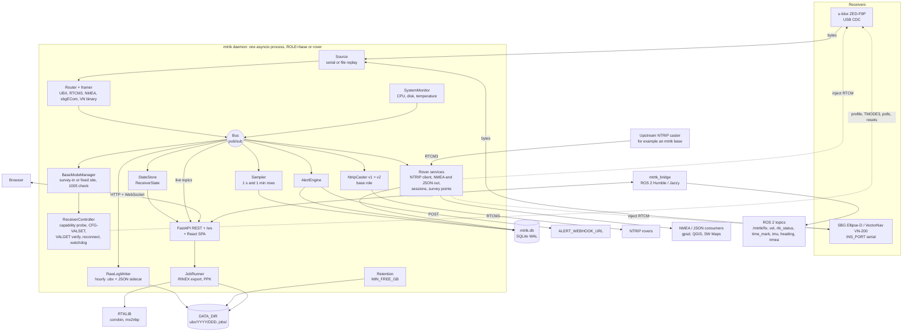

# Architecture

mtrtk runs as one asyncio process per host. Bytes from the receiver are split into frames and
published on an in-process pub/sub bus. Every consumer (raw logger, caster, state, sampler,
alerts, WebSocket, rover outputs) subscribes to the bus with its own queue and runs under restart
supervision. RTKLIB runs as a subprocess inside background jobs. The ROS 2 bridge is a separate
WebSocket client.

The README has a simplified version of this diagram. This one shows every component.

- **Base role:** caster, base-mode manager, raw logger and retention. **Rover role:** NTRIP client, outputs and survey points instead of the caster. Both roles run the web API, sampler, alerts and system monitor.
- **INS rover:** the vendor driver opens `INS_PORT` and fills the same `ReceiverState` in place of the u-blox `ReceiverController` and profile. Nothing downstream changes.
- **Replay:** the live receiver's bus subscription drops the oldest frames when it backs up; a replay (`file:` source) never drops. A replay is passive: it sends no configuration and runs no base-mode manager, so survey-in, TMODE3 writes and the 1005 check need a live receiver. It writes no raw logs unless `REPLAY_LOG=1`.
- **Remote base:** PPK fetches a remote base's raw hours from that base's own API (`GET /api/logs/window`).

The design specification is in
[`superpowers/specs/2026-09-18-mtrtk-design.md`](superpowers/specs/2026-09-18-mtrtk-design.md).
